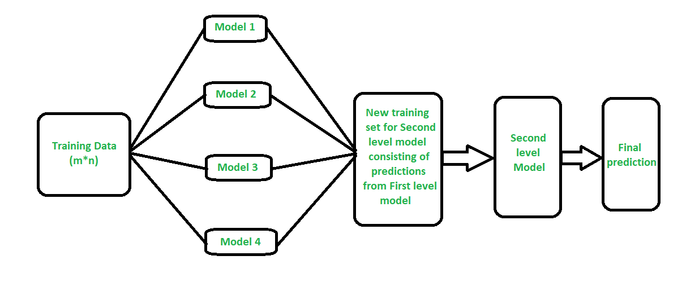

# Airbnb Price Prediction Using Machine Learning

In this project, I am going to look at Airbnb listings in Buenos Aires and trying to provide some exploratory analysis around predicting listing prices. First, I will use Exploratory Data Analysis (EDA) to get to know the data. This will help me get an initial sense of which variables are associated with price, and which variables to include in the model. Using the important variables identified in EDA, I will try several classification models attempting to predict the price. Finally, I will evaluate the performance of the model.

## Methods:
- Random Forest Classifier
- Gradient Boosting Classifier
- XGBoost Classifier
- Stacked Models

One possible way to improve the predictive accuracy is to combine different models. Stacking (sometimes called "stacked generalization") involves training a new learning algorithm to combine the predictions of several base learners. First, the base learners are trained using the available training data, then a combiner or meta algorithm, called the super learner, is trained to make a final prediction based on the predictions of the base learners. The following figure shows the structure of the stacked model. 

Such stacked ensemble often outperforms any of the individual base learners (e.g., a single random forest) and has been shown to represent an asymptotically optimal system for learning. 
